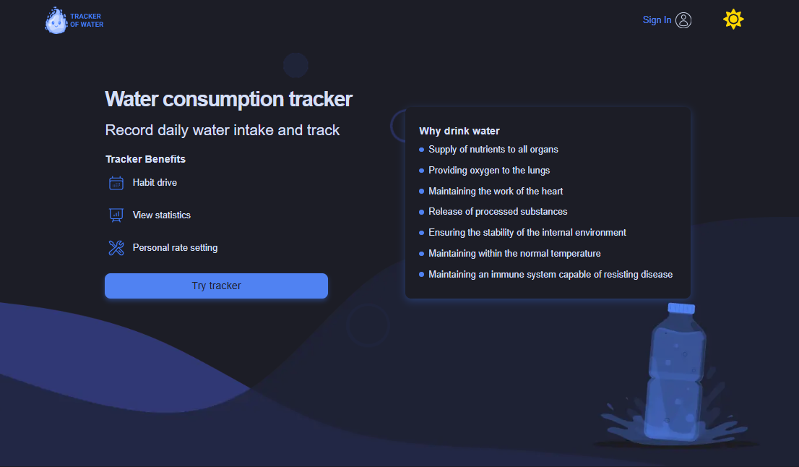

<h1 class="highlight">Water Tracker</h1>

 Water Tracker - web app for control and monitoring daily and monthly water consumption.
With the ability to register, change parameters and maintain statistics on water consumption.
Additionally, it is possible to change the theme of the application

<h2>Technologies Used</h2>

Used - React + vite, Node.js, MongoDB

<h2>Team</h2>

<table>
    <tr>
        <th>Name</th>
        <th>Role</th>
          <th>Git</th>
    </tr>
    <tr>
        <td>Sergiy</td>
        <td>Leam Lead </td>
        <td><a href="https://github.com/shulsergio" target="_blank" rel="noopener noreferrer">GitHub</a></td>
</tr>
    <tr>
        <td> Gennadii</td>
        <td>Scrum, Back End</td>
        <td><a href="https://github.com/GenchikS" target="_blank" rel="noopener noreferrer">GitHub</a></td>
</tr>    <tr>
        <td> Yuliia </td>
        <td>Front End developer </td>
        <td><a href="https://github.com/yuliia-vorobei" target="_blank" rel="noopener noreferrer">GitHub</a></td>
</tr>    <tr>
        <td> Kate </td>
        <td>Front End developer </td>
        <td><a href="https://github.com/turchynska" target="_blank" rel="noopener noreferrer">GitHub</a></td>
</tr>    <tr>
        <td> Svitlana </td>
        <td>Front End developer </td>
        <td><a href="https://github.com/svitlanahavrylets" target="_blank" rel="noopener noreferrer">GitHub</a></td>
</tr>    <tr>
        <td> Alona </td>
        <td>Front End developer </td>
        <td><a href="https://github.com/AlenaZabolotskykh" target="_blank" rel="noopener noreferrer">GitHub</a></td>
</tr>    <tr>
        <td> Inna </td>
        <td>Front End developer </td>
        <td><a href="https://github.com/Inna-Starovytska" target="_blank" rel="noopener noreferrer">GitHub</a></td>
</tr>    <tr>
        <td> Vitalii </td>
        <td> Front End developer </td>
        <td><a href="https://github.com/baschenko" target="_blank" rel="noopener noreferrer">GitHub</a></td>
</tr>
</tr>    <tr>
        <td> Andriy </td>
        <td> Front End developer </td>
        <td><a href="https://github.com/AndriyGoncharuk" target="_blank" rel="noopener noreferrer">GitHub</a></td>
</tr>
</tr>    <tr>
        <td> Ostap </td>
        <td> Front End developer </td>
        <td><a href="https://github.com/OstapUrdey" target="_blank" rel="noopener noreferrer">GitHub</a></td>
</tr>
</tr>    <tr>
        <td> Vitalii </td>
        <td> Front End developer </td>
        <td><a href="https://github.com/0Vitaliy" target="_blank" rel="noopener noreferrer">GitHub</a></td>
</tr>
</tr>    <tr>
        <td> Ivan </td>
        <td>Lead Back End developer </td>
        <td><a href="https://github.com/bahioiiia" target="_blank" rel="noopener noreferrer">GitHub</a></td>
</tr>
</tr>    <tr>
        <td> Olexandr  </td>
        <td> Back End developer </td>
        <td><a href="https://github.com/Solovey260885" target="_blank" rel="noopener noreferrer">GitHub</a></td>
</tr>

</table>
